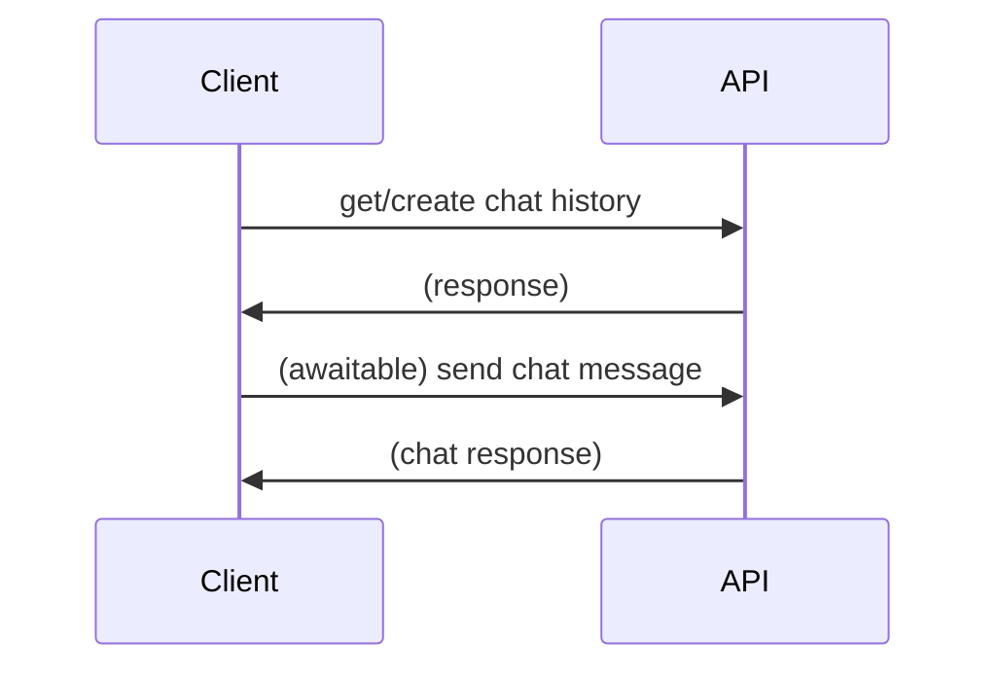

v1 chat sequence
================

## to chat



### get/create chat history

method : POST

endpoint

  * create : `/v1/chat/history/`
  * get : `/v1/chat/history/<id:str>`

str = uuid

response

json

```json
{
    'history_id': <uuid>,
    'chat_status': <str>,
    'status': <int>,
    'status_message': <str>,
    'version': 'v1',
    'messages_history': [
        <see message v1 definition>
    ]
}
```

### send chat message

method: POST

endpoint

  * `/v1/chat/send`

request

```json
{
    'history_id': <uuid>,
    'time': <datetime>,
    'botname': <str>,   # specify known botname
    'content': <str>,   # short summary written by Markdown
    'body': {
        <see mesage v1 definition>
    },
}
```

response

```json
{
    'history_id': <uuid>,
    'user_message_id': <uuid>,  # chat message send from user
    'message_id': <uuid>,       # response message from bots
    'time': <datetime>,
    'botname': <str>,   # specify known botname
    'content': <str>,   # short summary written by Markdown
    'body': {
        <see message v1 definition>
    },
}
```

